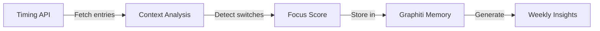

# CLAUDE.md

This file provides guidance to Claude Code (claude.ai/code) when working with code in this repository.

## Project Overview

GTD Coach is an ADHD-optimized Getting Things Done (GTD) weekly review system that uses LM Studio with a local Llama 3.1 8B model. The system provides structured, time-boxed coaching through five phases, with audio alerts and strict time limits designed specifically for ADHD users.

## Essential Commands

### IMPORTANT: Run all Python scripts in Docker/OrbStack
Due to Python environment management, all Python scripts should be run through Docker/OrbStack:

```bash
# Start the full system (handles LM Studio server and model loading)
~/gtd-coach/start-coach.sh

# Test timer functionality (native bash, no Docker needed)
~/gtd-coach/scripts/timer.sh 1 "Test complete!"
```

### Docker/OrbStack Commands (REQUIRED for Python scripts)

```bash
# Run weekly review in Docker
./docker-run.sh

# Test Timing app integration (NEW - ENHANCED)
./docker-run.sh timing

# Test full Timing + Graphiti integration
docker compose run gtd-coach python3 test_timing_graphiti_integration.py

# Test Langfuse integration
./docker-run.sh test

# Generate weekly summary (NOW WITH TIMING INSIGHTS)
./docker-run.sh summary

# Build/rebuild Docker image (required after dependency changes)
./docker-run.sh build

# Open shell in container for debugging
./docker-run.sh shell

# Using docker-compose directly
docker compose up gtd-coach            # Run review
docker compose run gtd-coach python3 test_timing_integration.py  # Test Timing
docker compose run test-langfuse       # Test Langfuse
docker compose run generate-summary    # Generate summary with Timing data
```

## Architecture

### Core Design Pattern
The system follows a **Phase-Based State Machine** with strict time boxing:
1. **STARTUP** (2 min) - Welcome and readiness check
2. **MIND SWEEP** (10 min) - Capture (5 min) + Processing (5 min)
3. **PROJECT REVIEW** (12 min) - Quick next-action decisions (45 sec per project)
4. **PRIORITIZATION** (5 min) - ABC priority assignment
5. **WRAP-UP** (3 min) - Save data and celebration

### Key Components
- **gtd-review.py**: Main orchestrator class `GTDCoach` manages the entire review process
- **start-coach.sh**: Handles LM Studio server lifecycle and model loading (now includes Langfuse health check)
- **scripts/timer.sh**: Standalone timer with audio alerts at 50%, 20%, and 10% remaining
- **prompts/**: System prompts (full vs simple) for ADHD-optimized coaching
- **graphiti_integration.py**: Async memory management with episode batching and Timing data storage
- **adhd_patterns.py**: ADHD pattern detection algorithms (enhanced with Timing analysis)
- **generate_summary.py**: Weekly insights generator with Timing focus metrics
- **langfuse_tracker.py**: Langfuse integration for LLM performance monitoring
- **test_langfuse.py**: Validation script for Langfuse connectivity and scoring
- **timing_integration.py**: Timing API client with context switch detection and focus scoring
- **timing_comparison.py**: Smart correlation between Timing projects and GTD priorities
- **test_timing_graphiti_integration.py**: Integration test for Timing + Graphiti flow

### Data Flow
```
User Input → Python Orchestrator → LM Studio API → Llama Model → Structured Response → JSON Logging
     ↓               ↓                    ↓
Timing API    Graphiti Memory      Langfuse Observability
     ↓               ↓                    ↓
Focus Metrics  Pattern Detection   Performance Metrics
     ↓               ↓                    ↓
     └──────→ Enhanced Weekly Summary ←──────┘
```

All data is persisted in:
- `data/`: Mindsweep captures, priorities, and Graphiti batches (JSON format with timestamps)
- `logs/`: Complete review session transcripts with Timing analysis
- `summaries/`: AI-generated weekly insights with focus scores (Markdown format)
- **Langfuse UI**: LLM performance metrics, traces, and quality scores (when configured)
- **Graphiti Episodes**: Include Timing focus metrics and context switch patterns

### API Integration
- LM Studio server: `http://localhost:1234/v1/chat/completions`
- Uses OpenAI-compatible API format
- Model: `meta-llama-3.1-8b-instruct` (Q4_K_M quantization)

## Development Guidelines

### ADHD-Specific Features (Preserve These)
- **Strict Time Boxing**: 30-minute total with phase-specific limits
- **Audio Alerts**: Progress warnings using macOS `afplay`
- **Structured Phases**: Prevents analysis paralysis
- **External Executive Function**: Coach provides constant time awareness
- **Pattern Tracking**: All sessions logged for behavioral insights

### Known Issues & Workarounds
- **Timeout Issue**: Large system prompts can cause timeouts
  - Current workaround: Using `system-prompt-simple.txt`
  - Future fix: Implement streaming or chunked responses
- **Platform Dependency**: Audio alerts use macOS-specific `afplay`
  - Future fix: Cross-platform audio solution
- **Timing API Parameters**: Fixed in latest version (2025-08-09)
  - Previous issue: Invalid `timespan_grouping_mode` parameter
  - Solution: Updated to use correct API parameters per documentation

### Testing Changes
1. Always test with `demo-review.py` first
2. Verify timer functionality with `scripts/timer.sh`
3. Check LLM connectivity with `test-simple-prompt.py`
4. Ensure all phases maintain their time limits

### Data Structures
All data is JSON-formatted:
- Mindsweep captures: List of strings with timestamps
- Priorities: ABC-categorized actions with project associations
- Session logs: Complete interaction history with timing metadata
- Graphiti episodes: Structured events with type, phase, and pattern data
- Behavior patterns: Task switches, coherence scores, focus indicators

## Critical Implementation Notes

1. **Timer Integration**: The timer runs as a subprocess and must be properly terminated
2. **Error Handling**: System gracefully handles LM Studio connection failures
3. **State Management**: Each phase transition is logged and timed
4. **User Input**: Uses direct `input()` calls - requires interactive terminal
5. **Model Context**: Llama 3.1 8B has 32,768 token context limit

## Memory Integration Architecture

### How Graphiti Integration Works
1. **Async Capture**: All interactions are queued using `asyncio.create_task()` to avoid blocking
2. **Batch Processing**: Episodes are flushed to disk after each phase to minimize I/O
3. **Pattern Detection**: Real-time analysis during mind sweep for task switching and coherence
4. **Session Summary**: Complete review data is compiled and saved at session end

### Adding New Pattern Types
To track additional ADHD patterns, extend `adhd_patterns.py`:
```python
def detect_new_pattern(self, data):
    # Add detection logic
    return pattern_data
```

### Memory Data Format
Episodes follow this structure:
```json
{
  "type": "interaction|phase_transition|behavior_pattern",
  "phase": "MIND_SWEEP",
  "data": {
    // Pattern-specific data
  },
  "timestamp": "ISO-8601",
  "session_id": "20250804_141824"
}
```

## Langfuse Integration Details

### What Gets Tracked
- **Response Latency**: Per-phase timing for each LLM interaction
- **Success/Failure Rates**: Retry patterns and error tracking
- **Quality Scores**: Three dimensions:
  - Binary success/failure
  - Phase-specific latency thresholds
  - Response appropriateness (for manual review)

### Implementation Approach
The integration uses Langfuse's drop-in OpenAI replacement:
1. Wraps LM Studio API calls with automatic tracing
2. Falls back gracefully if Langfuse is unavailable
3. Adds minimal overhead with background batching
4. Preserves all existing retry and error handling logic

### Configuration
Configure Langfuse by copying the example file and adding your keys:
```bash
cp langfuse_tracker.py.example langfuse_tracker.py
# Edit langfuse_tracker.py with your instance details:
# - LANGFUSE_HOST = "http://localhost:3000"
# - LANGFUSE_PUBLIC_KEY = "pk-lf-..."  # Your public key
# - LANGFUSE_SECRET_KEY = "sk-lf-..."  # Your secret key
```

## Timing App Integration ✅ ENHANCED WITH FOCUS TRACKING

### Setup
1. Copy `.env.example` to `.env`
2. Get your API key from https://web.timingapp.com (requires Timing Connect subscription)
3. Add the key to `.env` file:
   ```
   TIMING_API_KEY=your-key-here
   TIMING_MIN_MINUTES=30  # Optional: minimum project time threshold (default: 30)
   ```

### New Features (August 2025)
- **Focus Score Calculation**: 0-100 score based on context switch frequency
- **Context Switch Detection**: Tracks switches <5 minutes between projects
- **Hyperfocus Detection**: Identifies periods >30 minutes on single project
- **Scatter Period Analysis**: Detects rapid app-hopping (3+ switches in 15 min)
- **Priority Alignment**: Correlates time spent with GTD priorities
- **Smart Project Matching**: AI-powered correlation between Timing and GTD items
- **Time Sink Identification**: Categorizes unplanned time (browsing, communication, etc.)

### How It Works


- **Pre-fetching**: During STARTUP phase, fetches detailed time entries
- **Analysis**: During WRAP-UP phase, calculates focus metrics
- **Memory Storage**: Saves patterns to Graphiti for trend analysis
- **Weekly Summary**: Includes focus scores and alignment metrics

### Key Metrics
| Metric | Description | ADHD Relevance |
|--------|-------------|----------------|
| **Focus Score** | 0-100 rating | Higher = fewer context switches |
| **Switches/Hour** | Context switch frequency | <3 good, >10 concerning |
| **Alignment %** | Time on priorities | Shows intention vs reality |
| **Hyperfocus Score** | Deep work capability | Leverage these periods |

### Testing Commands
```bash
# Test basic Timing integration
./docker-run.sh timing

# Test full Timing + Graphiti flow
docker compose run gtd-coach python3 test_timing_graphiti_integration.py

# Run review with focus analysis
./docker-run.sh

# Generate summary with Timing insights
./docker-run.sh summary
```

### API Endpoints Used
- `/time-entries`: Individual time entries for context analysis
- `/report`: Aggregated project summaries for overview
- Parameters optimized for 3-second timeout constraint

## Graphiti Integration with Custom GTD Entities (FULLY IMPLEMENTED)

### Implementation Status (August 2025)
- ✅ **Custom Entity Extraction**: GTD-specific entities via Graphiti v0.18.5
- ✅ **User Context Centering**: Creates user node at review start for personalized searches
- ✅ **Cost-Aware Batching**: Intelligent batching to reduce API costs (~$0.01 per review)
- ✅ **Lightweight ADHD Detection**: Real-time pattern detection during interactions
- ✅ **Enhanced Monitoring**: Graphiti operations tracked in Langfuse
- ✅ **Selective Entity Application**: Custom entities only for content-rich episodes

### Cost & Performance Optimizations
- **Batch Size**: 5 episodes default (configurable via `GRAPHITI_BATCH_SIZE`)
- **Skip Trivial**: Filters out "ok", "yes", "thanks" etc. (`GRAPHITI_SKIP_TRIVIAL=true`)
- **Concurrency Limit**: 2 simultaneous LLM calls (`SEMAPHORE_LIMIT=2`)
- **Selective Sending**: Critical episodes sent immediately, others batched
- **Dual Mode**: JSON backup ensures zero data loss while optimizing Graphiti usage

### Real-time ADHD Support
The system now detects patterns DURING interaction:
- **Rapid Switching**: >3 topic changes in 30 seconds triggers intervention
- **Gentle Interventions**: Non-disruptive reminders to refocus
- **Pattern Tracking**: All interventions logged for analysis

### Custom Entity Types (ACTIVE)
The system uses GTD-specific entity extraction via Pydantic models in `gtd_entities.py`:

```python
# Available GTD Entity Types
- GTDProject: Projects with status, area of focus, next action, outcome
- GTDAction: Next actions with context, priority, energy level, time estimate
- GTDContext: Contexts like @home, @office with available time and tools
- GTDAreaOfFocus: Areas of responsibility with projects and maintenance tasks
- ADHDPattern: Behavioral patterns with severity, triggers, and duration
- MindsweepItem: Captured items with processing status
- WeeklyReview: Review session metadata with completion metrics
- TimingInsight: Focus scores and productivity metrics from Timing app
```

### Testing & Validation Commands

```bash
# Test Graphiti connection and basic operations
python3 test_graphiti_connection.py

# Test enhanced features (user context, batching, ADHD detection)
python3 test_enhanced_graphiti.py

# Test GTD entity extraction (OLD - for reference)
python3 test_gtd_entity_extraction.py

# Test custom entity extraction (NEW - validates v0.18.5 features)
python3 test_custom_entities.py

# Check Neo4j database state
python3 check_neo4j_state.py

# Run GTD data validation
python3 gtd_validation.py

# Benchmark performance (WARNING: may timeout with many iterations)
python3 benchmark_gtd_operations.py --iterations 2

# Migration commands
python3 migrate_to_graphiti.py  # Dry run by default
# Set MIGRATION_DRY_RUN=false in .env.graphiti for actual migration
```

### Configuration (.env.graphiti)
```bash
# Performance tuning
SEMAPHORE_LIMIT=2          # Concurrent LLM operations limit
GRAPHITI_BATCH_SIZE=5      # Episodes per batch
GRAPHITI_SKIP_TRIVIAL=true # Skip trivial responses
USE_GTD_ENTITIES=true      # Use custom entities when available
```

### Performance Targets
- Episode creation: <100ms (real-time capture)
- Mind sweep search: <200ms (review flow)
- Priority retrieval: <150ms (quick decisions)
- ADHD pattern detection: <500ms (can be async)
- Context query: <200ms (context switching)
- Project search: <250ms (project review)

### Migration Cost Estimates
Based on current data (21 files, 47 episodes):
- Total cost: ~$0.003 (negligible)
- Time: ~24 seconds
- Incremental migration supported with rollback points

### Validation Checks
The `gtd_validation.py` script checks for:
1. Actions without contexts
2. Projects without next actions
3. Temporal consistency
4. Mind sweep processing rate
5. Review frequency
6. ADHD pattern tracking
7. Priority distribution
8. Data quality (duplicates, empty relationships)

## Future Enhancement Opportunities

1. **Timing App Integration**: ✅ IMPLEMENTED - Real project data from Timing.app
2. **Graphiti Memory**: ✅ ENHANCED - Custom GTD entities with validation
3. **Langfuse Observability**: ✅ IMPLEMENTED - LLM performance monitoring
4. **Metrics Dashboard**: Visualize review completion and patterns
5. **Cross-Platform Support**: Replace macOS-specific components
6. **Streaming Responses**: Prevent timeout issues with large prompts
7. **Real-time MCP Integration**: Direct Graphiti API calls instead of batch files