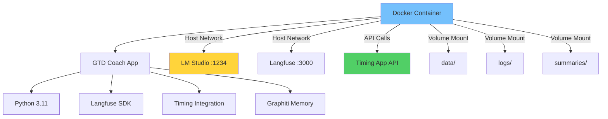

# 🐳 Docker Deployment for GTD Coach

> 🎯 **Quick Jump**: [Commands](#-quick-commands) | [Architecture](#-architecture) | [Troubleshooting](#-troubleshooting)

## 🌟 Overview

This deployment uses Docker/OrbStack to avoid Python "externally managed environment" issues while maintaining full functionality of the GTD Coach with Langfuse integration and **NEW: Timing app focus tracking**.

## 🏗️ Architecture



## ✨ Key Features

| Feature | Description | Benefit |
|---------|-------------|----------|
| **Host Networking** | OrbStack native support | Access localhost services |
| **Volume Mounts** | Persistent data storage | Keep your reviews |
| **Live Code Updates** | Read-only mounts | Quick iteration |
| **Audio Alerts** | Gracefully disabled | Works everywhere |
| **🆕 Timing Integration** | API access | Focus tracking |
| **🆕 Graphiti Memory** | Pattern storage | Learn from history |

## 🚀 Quick Commands

### Essential Commands

```bash
# Run weekly review with all features
./docker-run.sh

# 🆕 Test Timing integration
./docker-run.sh timing

# 🆕 Analyze Timing project organization  
./docker-run.sh analyze-timing

# Test Langfuse integration
./docker-run.sh test

# Generate weekly summary with focus metrics
./docker-run.sh summary

# Rebuild after adding dependencies
./docker-run.sh build

# Debug in container shell
./docker-run.sh shell
```

### Advanced Docker Compose

```bash
# Run specific services
docker compose run --rm gtd-coach
docker compose run --rm test-langfuse
docker compose run --rm generate-summary

# 🆕 Test full Timing + Graphiti integration
docker compose run gtd-coach python3 test_timing_graphiti_integration.py

# View real-time logs
docker compose logs -f gtd-coach

# Clean shutdown
docker compose down
```

## 📁 File Structure

```
gtd-coach/
├── 🐳 Dockerfile           # Multi-stage Python build
├── 🏭 docker-compose.yml   # Service orchestration
├── 🚀 docker-run.sh        # Quick launcher
├── 🚫 .dockerignore        # Exclude patterns
├── 📚 requirements.txt     # Dependencies
├── 🔒 .env                 # Timing API key (create from .env.example)
└── 💾 data/                # Persisted reviews & patterns
```

## 💪 Benefits

| Benefit | Description | ADHD Win |
|---------|-------------|----------|
| **No Python Hell** | Official image | Just works |
| **Consistent Env** | Same every time | No surprises |
| **Easy Updates** | One command | Stay current |
| **Dev Friendly** | Live mounts | Quick fixes |
| **Cloud Ready** | Deploy anywhere | Scale up |

## 🆘 Troubleshooting

### Common Issues & Quick Fixes

| Problem | Solution |
|---------|----------|
| **Can't connect to LM Studio** | Check `lms server start` on host |
| **Permission errors** | Use `sudo` for file cleanup |
| **First run slow** | Normal - downloading images |
| **No audio alerts** | Expected - visual indicators work |
| **🆕 No Timing data** | Check `.env` has API key |
| **🆕 Focus score missing** | Run `./docker-run.sh timing` to test |

## 🔒 Security Notes

### Sensitive Data
- ✅ Langfuse keys in `langfuse_tracker.py` (use `.example`)
- ✅ Timing API key in `.env` (never commit)
- ✅ `.gitignore` excludes all sensitive files
- ✅ Use env vars for production deployments

## 🎯 Next Steps

### Quick Wins
1. ✅ Add Timing API key to `.env`
2. ✅ Run first review: `./docker-run.sh`
3. ✅ Check focus score in wrap-up
4. ✅ Generate summary: `./docker-run.sh summary`

### Advanced
1. 📊 Monitor in Langfuse UI (localhost:3000)
2. 📈 Track focus score trends weekly
3. ⏱️ Adjust phase timings if needed
4. ☁️ Deploy to cloud with secrets manager

---

**Pro Tip**: Docker makes everything easier - no Python issues, consistent environment, one-command updates! 🐳🚀