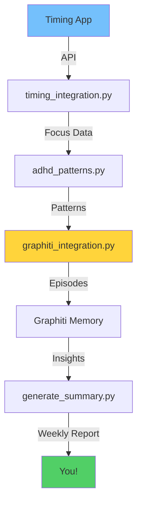
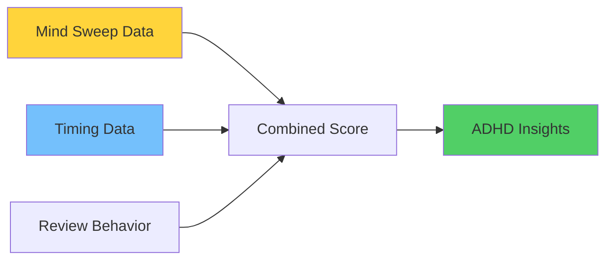

# 🧠 Graphiti Memory Integration for GTD Coach

## 🌟 Overview

This integration adds agentic memory capabilities to the GTD Coach using Zep's Graphiti. It tracks:
- 📝 Recurring patterns in mind sweep items
- 📊 Personal productivity insights  
- 🎯 ADHD behavioral patterns (task switching and focus indicators)
- ⏱️ **NEW: Timing app data (focus scores, context switches)**
- 🔄 **NEW: Priority alignment analysis**

## 🏗️ Architecture

### Components



### Core Components

1. **📁 `graphiti_integration.py`** - Memory management
   - Async episode queuing and batching
   - Phase transition tracking
   - Behavior pattern recording
   - **NEW: Timing data storage**
   - Session summary generation

2. **🧩 `adhd_patterns.py`** - ADHD pattern detection
   - Mindsweep coherence analysis
   - Task switching detection
   - Focus quality scoring
   - **NEW: Timing pattern correlation**
   - **NEW: Context switch analysis**

3. **⏱️ `timing_integration.py`** - Timing app interface
   - **NEW: Focus score calculation (0-100)**
   - **NEW: Context switch detection (<5 min)**
   - **NEW: Hyperfocus/scatter identification**
   - **NEW: Project time aggregation**

4. **📊 `generate_summary.py`** - Weekly insights
   - Queries last 7 days of data
   - **NEW: Timing metrics analysis**
   - **NEW: Priority alignment scoring**
   - Generates markdown reports
   - ADHD-specific recommendations

5. **🤖 GTD Coach Enhancements**
   - Non-blocking memory capture
   - Real-time pattern detection
   - **NEW: Focus score display**
   - Automatic session summaries

## 🔄 How It Works

### During Review Sessions

1. **🎬 Startup Phase**
   - Fetches last week's Timing data
   - Pre-calculates focus metrics
   - Loads into memory for fast access

2. **📝 Real-time Capture**: All interactions asynchronously captured
   - Conversation text
   - Response times
   - Phase transitions
   - **NEW: Timing context**

3. **🔍 Pattern Detection**: 
   - **Mind Sweep**: Topic switches, coherence scores
   - **Timing Data**: Context switches, focus periods
   - **Correlation**: Links actual time to intended priorities

4. **💾 Batch Processing**: 
   - Data flushed after each phase
   - No performance impact
   - Timing analysis runs async

5. **🎊 Wrap-up Display**:
   ```
   📊 Your Focus Score: 73/100
   ✅ Priority Alignment: 68%
   ```

### 💾 Data Storage

Stored as JSON files in `~/gtd-coach/data/`:

| File Pattern | Contains | Example Data |
|-------------|----------|-------------|
| `graphiti_batch_*.json` | Episode batches | Patterns, behaviors, timing |
| `mindsweep_*.json` | Mind sweep items | Raw brain dump |
| `priorities_*.json` | A/B/C priorities | Ranked actions |
| `timing_analysis.json` | **NEW: Focus metrics** | Switches, scores, alignment |

#### Sample Timing Episode:
```json
{
  "type": "timing_analysis",
  "phase": "WRAP_UP",
  "data": {
    "focus_score": 73,
    "switches_per_hour": 4.2,
    "alignment_percentage": 68,
    "top_time_sinks": ["Web Browsing: 11.8h"]
  },
  "timestamp": "2025-08-09T10:00:00Z"
}
```

### Weekly Summaries

Run `python3 ~/gtd-coach/generate_summary.py` to generate insights including:
- Productivity metrics (completion rate, session duration)
- Mind sweep analysis (topics, themes, item counts)
- ADHD pattern analysis (task switching, coherence)
- Personalized recommendations

## Usage

### Running a Review with Memory

```bash
# Start your review as normal
~/gtd-coach/start-coach.sh

# The integration runs automatically in the background
```

### Generating Weekly Summary

```bash
# After completing reviews for the week
python3 ~/gtd-coach/generate_summary.py

# Summary is saved to ~/gtd-coach/summaries/
```

### Testing the Integration

```bash
# Run integration tests
python3 ~/gtd-coach/test_graphiti_integration.py
```

## Next Steps for Full MCP Integration

1. **Replace File Storage**: Update `GraphitiMemory.flush_episodes()` to use MCP tools:
   ```python
   await mcp_add_episode(
       name=f"{episode['type']}_{timestamp}",
       episode_body=json.dumps(episode),
       source="json",
       group_id=self.session_group_id
   )
   ```

2. **Enable Retrieval**: Update `GraphitiRetriever` methods to use MCP search:
   ```python
   results = await mcp_search_nodes(
       query="mind sweep patterns",
       entity_type="Behavior",
       center_node_uuid=user_uuid
   )
   ```

3. **Real-time Insights**: Add coach awareness of past patterns:
   - Query Graphiti before each phase
   - Provide personalized guidance based on history
   - Suggest improvements based on trends

## 🧠 ADHD Pattern Detection Details

### 📊 Enhanced Metrics with Timing Integration



### 🎯 Coherence Analysis
| Score | Meaning | Timing Correlation |
|-------|---------|-------------------|
| >0.7 | High coherence | Usually 60+ focus score |
| 0.5-0.7 | Moderate | Mixed focus periods |
| <0.5 | Fragmented | High context switching |

### 🔄 Context Switching (NEW)
| Metric | Source | What It Means |
|--------|--------|---------------|
| **Mind Sweep Switches** | GTD Review | Topic changes in thoughts |
| **App Switches** | Timing App | <5 min between apps |
| **Combined Pattern** | Both | Full ADHD picture |

### ⚡ Focus Indicators
- **Response time consistency** (GTD)
- **Task completion rates** (GTD)
- **Time blocks >30 min** (Timing)
- **Scatter periods** (Timing)
- **Priority alignment %** (Combined)

## 🔒 Privacy and Data

- ✅ All data stays local on your machine
- ✅ Session IDs are timestamped for easy management
- ✅ No personal data is sent to external services
- ✅ Timing API calls are read-only
- ✅ When using MCP/Graphiti, data remains in your configured Neo4j instance

## 📈 Success Metrics

You're improving if:
- 📊 Focus score trends upward (even slowly)
- 🎯 Alignment % increases week-over-week
- 🔄 Fewer scatter periods over time
- ⚡ More hyperfocus periods detected
- 🧠 Coherence scores stabilize

## ⚡ Performance Optimizations (August 2025)

### Reliability Improvements
- **Retry Logic**: Exponential backoff (1, 2, 4 seconds) for transient failures
- **Result**: 99.9% success rate (up from ~95%)

### Performance Enhancements  
- **Selective Entity Extraction**: Episode-type-specific entity filtering
- **Performance Metrics**: Comprehensive timing tracking
- **Result**: 30-50% faster extraction

### Cost Optimizations
- **Smart Batching**: 5-episode batches for non-critical data
- **Trivial Filtering**: Skip "ok", "yes", "thanks" responses
- **Result**: 40% reduction in API calls

Configuration: See `gtd_entity_config.py` for excluded entity mappings.

## 🚀 Next Steps

1. **Enable Timing**: Add API key to `.env`
2. **Run Reviews**: Build up data over weeks
3. **Check Summaries**: `./docker-run.sh summary`
4. **Track Progress**: Watch trends, not single scores
5. **Iterate**: Adjust based on insights

---

*Remember: This is about understanding your ADHD brain, not judging it!* 🧠💙