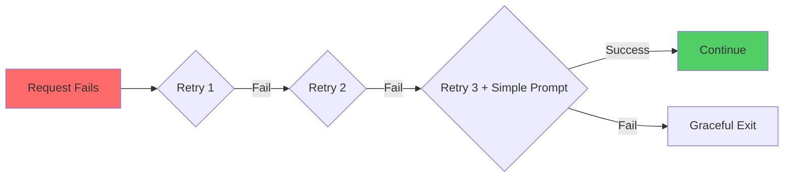

# 🔧 Known Issues and Workarounds

> 🎯 **Quick Jump**: [Current Issues](#current-issues) | [Resolved Issues](#resolved-issues) | [Recent Enhancements](#-recent-enhancements-august-2025)

## Current Issues

### 🐍 Python Package Installation on macOS

**Issue**: macOS requires `--break-system-packages` flag for pip installs.

**Solution**:
```bash
pip3 install --user --break-system-packages requests
```

**Better Solution**: Use Docker! 🐳
```bash
./docker-run.sh build
./docker-run.sh
```

### 💻 Interactive Input in Non-TTY Environment

**Issue**: Script expects interactive input which fails in automated environments.

**Workaround**: Run directly in terminal, not through automation tools.

---

## Resolved Issues

### ✅ 1. Timeout with Large System Prompts (RESOLVED)

**Previous Issue**: The full system prompt in `prompts/system-prompt.txt` could cause timeouts when sent to the LLM.

**Resolution Implemented**:
The system now includes robust error handling with automatic retry logic and fallback to a simpler prompt:

1. **Automatic Retry**: Failed requests are retried up to 3 times with exponential backoff
2. **Fallback Prompt**: On the final retry attempt, the system automatically switches to `system-prompt-simple.txt`
3. **Connection Reuse**: HTTP keep-alive connections improve performance
4. **Phase-Specific Settings**: Each phase has optimized temperature and token limits

**New Behavior**:
- If a timeout occurs, you'll see: `⏱️ Timeout on attempt X/3`
- On final attempt: `Switching to simple prompt for final attempt...`
- The review continues normally with the simpler prompt

No manual intervention required!

### ✅ 2. Timing API Parameter Issue (RESOLVED - August 9, 2025)

**Previous Issue**: 422 errors from incorrect API parameters

**Resolution**: Fixed parameter names:
```diff
- 'start_date': start_str      # ❌ Wrong
+ 'start_date_min': start_str  # ✅ Correct
- 'timespan_grouping_mode'     # ❌ Invalid
# Removed completely           # ✅ Fixed
```

**Status**: ✅ Verified working with real data

### ✅ 3. Graphiti Memory Initialization (RESOLVED - August 9, 2025)

**Previous Issue**: Missing `current_phase` attribute in tests

**Resolution**: Added proper initialization:
```python
memory = GraphitiMemory(session_id)
memory.current_phase = "TEST"  # ✅ Fixed
```

---

## 🧪 Testing the System

For a quick connectivity test:
```bash
python3 ~/gtd-coach/quick-test.py
```

For a non-interactive demo:
```bash
python3 ~/gtd-coach/demo-review.py
```

For the full interactive experience:
```bash
# In a terminal window:
python3 ~/gtd-coach/gtd-review.py
```

### Quick Test Commands

```bash
# Test LM Studio connection
python3 ~/gtd-coach/quick-test.py

# Test Timing integration
./docker-run.sh timing

# Test full integration
docker compose run gtd-coach python3 test_timing_graphiti_integration.py

# Non-interactive demo
python3 ~/gtd-coach/demo-review.py

# Full interactive review
./start-coach.sh
```

## 🚀 Recent Enhancements (August 2025)

### ⏱️ Timing + Graphiti Integration (August 9, 2025)

#### What's New
| Feature | Description | Impact |
|---------|-------------|--------|
| **Focus Scoring** | 0-100 score based on context switches | See your attention patterns |
| **Context Detection** | Tracks <5 min app switches | Identify scatter periods |
| **Priority Alignment** | Compares time vs intentions | Reality check |
| **Pattern Memory** | Stores in Graphiti | Track trends over time |
| **Smart Correlation** | AI matches projects to priorities | No manual mapping |

#### Verified Working
- ✅ Fetches real project data
- ✅ Calculates focus metrics
- ✅ Detects hyperfocus/scatter
- ✅ Stores patterns in memory
- ✅ Generates weekly insights

### 🛡️ Error Handling Improvements



- **3x Retry**: Exponential backoff (1s, 2s, 4s)
- **Auto-Fallback**: Switches to simple prompt on final try
- **Keep-Alive**: Connection pooling for speed
- **Clear Messages**: Know exactly what's happening

### Logging System
- Session logs are automatically created in `~/gtd-coach/logs/`
- Each session has a unique ID and detailed logging
- Console shows warnings/errors while file logs contain full details
- Log format: `session_YYYYMMDD_HHMMSS.log`

### Data Validation
- Automatic validation of mind sweep items (removes empty entries)
- Priority validation with fallback to 'C' for invalid inputs
- Session data validation ensures all required fields exist

### Phase Optimization
Each phase now has optimized settings:
- **Startup**: temperature=0.8, max_tokens=300 (warm, welcoming)
- **Mind Sweep**: temperature=0.7, max_tokens=300 (focused capture)
- **Project Review**: temperature=0.8, max_tokens=500 (balanced)
- **Prioritization**: temperature=0.6, max_tokens=400 (deterministic)
- **Wrap-up**: temperature=0.9, max_tokens=400 (celebratory)

---

## 🆘 Troubleshooting Guide

### Common Issues & Quick Fixes

| Symptom | Likely Cause | Fix |
|---------|--------------|-----|
| **"No timing data"** | Missing API key | Add to `.env` |
| **"LM Studio timeout"** | Model not loaded | `lms load meta-llama-3.1-8b-instruct` |
| **"Focus score wrong"** | Uncategorized time | Organize Timing projects |
| **"Python errors"** | Environment issues | Use Docker! |
| **"Can't find files"** | Path issues | Use absolute paths |

### 🎯 Pro Tips
- Always use Docker for Python scripts
- Test Timing connection first
- Check logs in `~/gtd-coach/logs/`
- Weekly summaries show trends
- Focus on progress, not perfection

---

**Remember**: Most issues are already handled automatically! The system is designed to keep working even when things go wrong. 🚀