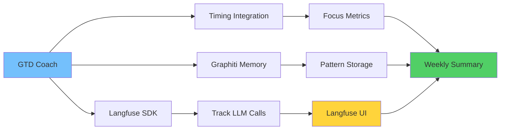

# 📊 Langfuse Integration for GTD Coach

> 🎯 **Quick Jump**: [Setup](#-quick-start) | [Scoring](#-quality-scoring) | [Architecture](#-system-architecture)

## 🌟 Overview

This integration adds LLM performance monitoring to GTD Coach using Langfuse, tracking:
- ⏱️ Response latency per phase
- ✅ Success/failure rates  
- 💯 Quality scores based on phase-specific thresholds
- 🆕 **Works alongside**: Timing integration for complete metrics

## 🐳 Docker Deployment (Recommended)

Since Python environments are tricky, we use Docker/OrbStack for simplicity.

### ✅ Prerequisites Checklist

| Component | Setup | Check |
|-----------|-------|-------|
| **OrbStack/Docker** | Install from orbstack.dev | `docker ps` |
| **LM Studio** | Load Llama 3.1 8B model | `lms ps` |
| **Langfuse** | Run on port 3000 | Visit localhost:3000 |
| **API Keys** | Configure tracker | See below |

### 🔐 Configure Keys
```bash
cp langfuse_tracker.py.example langfuse_tracker.py
# Edit with your keys from Langfuse UI
```

### 🚀 Quick Start

```bash
# 1. Test connection first
./docker-run.sh test

# 2. Run weekly review with tracking
./docker-run.sh

# 3. Generate insights (includes Timing data!)
./docker-run.sh summary

# 4. View metrics
open http://localhost:3000
```

### How It Works

The Docker setup:
- Uses official Python 3.11 image (avoids "externally managed" issues)
- Uses OrbStack's native host networking to connect to LM Studio and Langfuse
- Mounts your local data/logs/summaries directories for persistence
- Handles audio alerts gracefully (disabled in container)

### Testing the Integration

1. **Test Langfuse connectivity**:
   ```bash
   ./docker-run.sh test
   ```
   
   This will verify:
   - Configuration is valid
   - Can connect to Langfuse
   - Can make tracked LLM calls
   - Scoring works correctly

2. **Run a review with tracking**:
   ```bash
   ./docker-run.sh
   ```
   
   Then check Langfuse UI at http://localhost:3000 to see:
   - Session traces
   - Phase transitions
   - Response latencies
   - Quality scores

## 💯 Quality Scoring

### Three Dimensions

| Score Type | Range | What It Measures |
|------------|-------|------------------|
| **Success** | 0-1 | Did it work? |
| **Quality** | 0-1 | Was it fast? |
| **Appropriateness** | Manual | Was it good? |

### Phase-Specific Thresholds

| Phase | Max Latency | Why |
|-------|-------------|-----|
| **STARTUP** | 5.0s | Warm welcome OK |
| **MIND_SWEEP** | 3.0s | Keep momentum |
| **PROJECT_REVIEW** | 2.0s | Quick decisions |
| **PRIORITIZATION** | 3.0s | Processing time |
| **WRAP_UP** | 4.0s | Celebration time |

## 🏗️ System Architecture



### Data Flow
1. **GTD Review** → Makes LLM calls
2. **Langfuse SDK** → Intercepts & tracks
3. **Metrics** → Sent to Langfuse server
4. **Analysis** → Combined with Timing data
5. **Insights** → Weekly summary generation

## 🆘 Troubleshooting

| Problem | Solution |
|---------|----------|
| **"Cannot connect to Langfuse"** | Check localhost:3000 in browser |
| **"Invalid API keys"** | Re-copy from Langfuse UI settings |
| **"LM Studio not found"** | Run `lms server start` |
| **"Permission denied"** | Run `chmod +x docker-run.sh` |
| **"No audio alerts"** | Normal in Docker - visual works |
| **🆕 "No tracking data"** | Check `./docker-run.sh test` |

## 🎯 Next Steps

### Quick Wins
1. ✅ Run 3 reviews to build baseline
2. ✅ Check latency patterns in UI
3. ✅ Identify slow phases
4. ✅ Optimize problem areas

### Advanced Integration
1. 📈 Combine with Timing focus scores
2. 🧠 Correlate with Graphiti patterns
3. 🚨 Set up alerts for degradation
4. 📊 Export metrics for analysis

## 📊 What You'll See in Langfuse

### Per Session
- Session traces with all phases
- Response times per interaction
- Success/failure patterns
- Quality scores

### Over Time
- Average latency trends
- Phase performance comparison
- Error rate tracking
- Model consistency

---

**Pro Tip**: Langfuse + Timing + Graphiti = Complete ADHD performance picture! 🧠📊⏱️