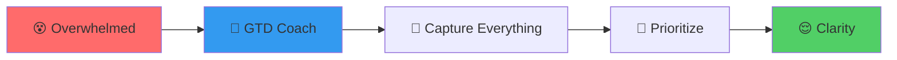
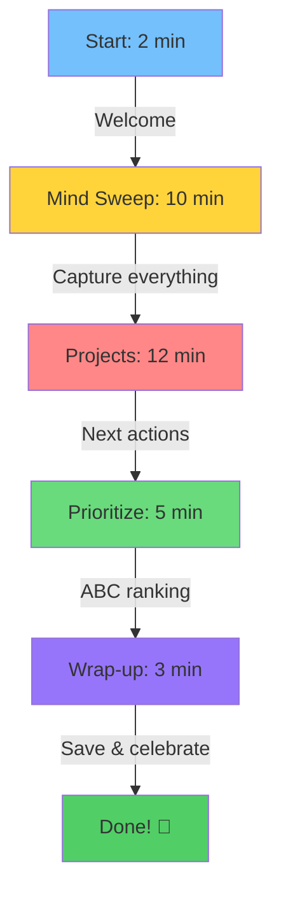

# 🧠 GTD Coach for ADHD

**30-minute weekly reviews that actually work for ADHD brains**

> 🎯 **Quick Start**: [Jump to 3-step setup](#-quick-start-3-steps) | 📖 [Usage Guide](USAGE_GUIDE.md) | 🔧 [Troubleshooting](#-troubleshooting)

## 🌟 What It Does



**GTD Coach** gives you an AI-powered executive function assistant that:
- ⏱️ **Time-boxes everything** (30 minutes max)
- 🔊 **Audio alerts** keep you on track
- 📊 **Tracks your patterns** to improve over time
- 🎯 **Focus scoring** from your Timing app data
- 🤝 **ADHD-optimized** prompting and pacing

## 🚀 Quick Start (3 Steps)

### Step 1: Install LM Studio
```bash
# Download from: https://lmstudio.ai
# Load model: meta-llama-3.1-8b-instruct
```

### Step 2: Get GTD Coach
```bash
git clone https://github.com/devops-adeel/gtd-coach.git
cd gtd-coach
```

### Step 3: Start Your Review
```bash
./start-coach.sh
```

That's it! 🎉

## 📦 Installation Options

<details>
<summary><b>🐳 Docker/OrbStack (Recommended)</b> - Click to expand</summary>

### Why Docker?
✅ No Python issues  
✅ Works everywhere  
✅ Clean setup  

### Setup
```bash
# Install OrbStack: https://orbstack.dev

# Build once
./docker-run.sh build

# Run review
./docker-run.sh
```

### Docker Commands
| Command | What it does |
|---------|-------------|
| `./docker-run.sh` | Run weekly review |
| `./docker-run.sh timing` | Test Timing integration |
| `./docker-run.sh summary` | Generate weekly insights |
| `./docker-run.sh test` | Test Langfuse tracking |

</details>

<details>
<summary><b>🐍 Native Python</b> - Click to expand</summary>

### Requirements
- Python 3.8+
- macOS (for audio alerts)
- pip packages

### Setup
```bash
# Install dependencies
pip install -r requirements.txt

# Run directly
python3 gtd-review.py
```

</details>

## ✨ Features at a Glance

| Feature | What it does | Why it helps ADHD |
|---------|--------------|-------------------|
| **⏰ Time Boxing** | 30-min reviews | Prevents hyperfocus |
| **🔊 Audio Alerts** | Progress warnings | External reminders |
| **📊 Focus Score** | 0-100 rating | Track improvement |
| **🧠 Memory** | Pattern tracking | Learn your habits |
| **⏱️ Timing Integration** | Real project data | See where time goes |
| **📈 Weekly Summaries** | AI insights | Spot trends |
| **🚀 Graphiti v0.18.5** | Custom GTD entities + 40% cost reduction | Smarter memory |

## 🔄 How It Works



### Phase Breakdown

| Phase | Time | What You Do |
|-------|------|------------|
| 🚀 **Startup** | 2 min | Get ready, load projects |
| 🧹 **Mind Sweep** | 10 min | Dump everything from brain |
| 📋 **Projects** | 12 min | Quick next-action decisions |
| 🎯 **Prioritize** | 5 min | A/B/C ranking |
| 🎊 **Wrap-up** | 3 min | Save & celebrate |

## 🔗 Integrations

### ⏱️ Timing App
<details>
<summary>Track where your time actually goes - Click to setup</summary>

1. **Get API Key**: [web.timingapp.com](https://web.timingapp.com)
2. **Configure**: 
   ```bash
   cp .env.example .env
   # Add: TIMING_API_KEY=your-key-here
   ```
3. **Test**: `./docker-run.sh timing`

**What you get:**
- 📊 Focus score (0-100)
- 🔄 Context switch tracking
- ⚡ Priority alignment %
- 🎯 Time sink identification

</details>

### 📈 Langfuse (Optional)
<details>
<summary>Track AI performance - Click to setup</summary>

1. **Run Langfuse**: 
   ```bash
   docker run -p 3000:3000 langfuse/langfuse
   ```
2. **Configure**:
   ```bash
   cp langfuse_tracker.py.example langfuse_tracker.py
   # Add your keys
   ```
3. **View**: http://localhost:3000

</details>

## 🆘 Troubleshooting

| Problem | Solution |
|---------|----------|
| **"LM Studio not running"** | Run: `lms server start` |
| **"Model not loaded"** | Run: `lms load meta-llama-3.1-8b-instruct` |
| **"No timing data"** | Check `.env` has `TIMING_API_KEY` |
| **"Python errors"** | Use Docker: `./docker-run.sh` |

## 📁 What Gets Saved

```
~/gtd-coach/
├── 📝 data/           # Your captured items
├── 📊 logs/           # Review transcripts  
├── 💡 summaries/      # Weekly insights
└── 🧠 graphiti/       # Memory & patterns
```

## 🎯 Tips for ADHD Success

### Before Review
- ☕ **Caffeine**: Have it ready
- 📱 **Phone**: Different room
- 🚶 **Movement**: Stand or walk

### During Review
- ⏰ **Trust timers**: They're your friend
- 📝 **Brain dump**: Don't filter
- 🎯 **Good enough**: Perfect is the enemy

### After Review
- 🎉 **Celebrate**: You did it!
- 📊 **Check insights**: `./docker-run.sh summary`
- 📅 **Schedule next**: Same time next week

## 📚 Documentation

| Guide | For When You... |
|-------|-----------------|
| [📖 Usage Guide](USAGE_GUIDE.md) | Want detailed instructions |
| [⚡ Quick Reference](QUICK_REFERENCE.md) | Need a cheat sheet |
| [⏱️ Timing Setup](TIMING_SETUP.md) | Want focus tracking |
| [🧠 Memory System](GRAPHITI_INTEGRATION.md) | Curious about patterns |
| [🔧 Troubleshooting](KNOWN_ISSUES.md) | Hit a snag |

## 🚀 Latest Updates (August 2025)

### ✅ New: Timing + Graphiti Integration
- **Focus Scoring**: Real-time attention metrics
- **Context Switching**: Track app-hopping patterns  
- **Priority Alignment**: See if time matches goals
- **ADHD Insights**: Personalized recommendations

### 🔄 What's Next?
- [ ] Mobile app
- [ ] Voice input
- [ ] Real-time coaching
- [ ] Team reviews

## 💬 Getting Help

- **Issues**: [GitHub Issues](https://github.com/devops-adeel/gtd-coach/issues)
- **Quick fixes**: See [Troubleshooting](#-troubleshooting)
- **Details**: Check [KNOWN_ISSUES.md](KNOWN_ISSUES.md)

---

**Remember**: A messy done review > perfect procrastination! 🎯

*Built with ❤️ for ADHD brains by ADHD brains*