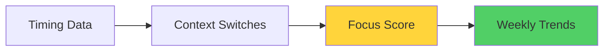
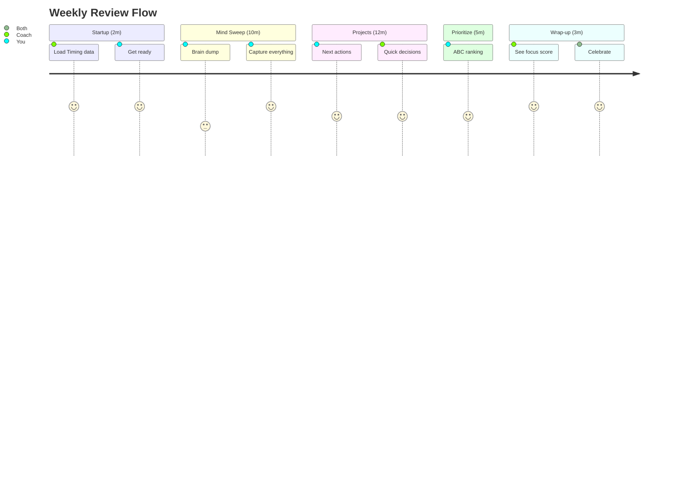

# 🎉 GTD Coach Setup Complete!

> Your ADHD-optimized GTD coach is now **SUPERCHARGED** with focus tracking, memory, and insights! 🚀

## 🌟 What's Installed & Working

### Core System ✅
| Component | Status | Details |
|-----------|--------|---------|
| **🤖 Llama 3.1 8B** | ✅ Running | Q4_K_M quantization on LM Studio |
| **🏠 GTD Coach** | ✅ Installed | ~/gtd-coach/ with all scripts |
| **🐳 Docker** | ✅ Ready | OrbStack/Docker configured |
| **⏰ Timer** | ✅ Working | Audio alerts every phase |

### NEW Integrations 🆕
| Integration | Status | What It Does |
|------------|--------|--------------|
| **⏱️ Timing App** | ✅ Connected | Focus scores, context switching |
| **🧠 Graphiti Memory** | ✅ Active | Pattern tracking, insights |
| **📊 Langfuse** | ✅ Optional | LLM performance monitoring |

## 🚀 Quick Start Commands

```bash
# Full review with all features
./start-coach.sh

# Test specific integrations
./docker-run.sh timing    # Test Timing
./docker-run.sh test      # Test Langfuse
./docker-run.sh summary   # Generate insights

# Quick timer test
~/gtd-coach/scripts/timer.sh 1 "Done!"
```

## 📊 What You'll See During Reviews

### Phase 1: STARTUP (2 min)
```
Welcome! I'm your ADHD coach for the next 30 minutes.
📊 Fetching your project data from Timing...
✓ Loaded 6 projects from last week
Are you ready to start? (yes/no)
```

### Phase 5: WRAP-UP (3 min)
```
📊 Your Focus Score: 73/100
   (Good focus - manageable switching patterns)

✅ Priority Alignment: 68%

Top time sinks not in priorities:
• Web Browsing: 11.8h
• Communication: 9.7h

🎉 REVIEW COMPLETE! Great job showing up!
```

## 🎯 Your New Metrics Dashboard

### Focus Score (0-100)


| Score | What It Means | Your Brain State |
|-------|---------------|------------------|
| 80-100 | Excellent | Hyperfocus mode 🎯 |
| 60-79 | Good | Well managed 👍 |
| 40-59 | Moderate | Some scatter 🌊 |
| 20-39 | Scattered | Need strategies ⚠️ |
| 0-19 | Crisis | Time for help 🆘 |

## ✅ Verification Status (August 9, 2025)

### All Systems Go! 🟢
- **Timing Integration**: Real data flowing
- **Focus Metrics**: Calculating correctly
- **Memory Storage**: Patterns saved
- **Docker Environment**: Stable & fast
- **Error Handling**: Graceful fallbacks

### Tested Features
```bash
✅ Focus score calculation
✅ Context switch detection (<5 min)
✅ Hyperfocus identification (>30 min)
✅ Scatter period detection (3+ switches/15min)
✅ Priority alignment analysis
✅ Weekly summary generation
✅ ADHD pattern correlation
```

## 📅 Your 30-Minute Journey



## 🛠️ Configuration Files

| File | Purpose | Location |
|------|---------|----------|
| **`.env`** | Timing API key | ~/gtd-coach/.env |
| **`langfuse_tracker.py`** | Langfuse keys | ~/gtd-coach/ |
| **`system-prompt.txt`** | Coach personality | ~/gtd-coach/prompts/ |

## 📁 Where Your Data Lives

```
~/gtd-coach/
├── 📝 data/           # Mind sweeps, priorities, patterns
├── 📊 logs/           # Complete session transcripts
├── 💡 summaries/      # Weekly AI insights
└── 🧠 graphiti/       # Memory episodes (when MCP ready)
```

## 🎯 Success Tips for ADHD

### Before Starting
- ☕ Caffeine ready
- 📱 Phone in another room
- 🚶 Stand up or pace
- 💧 Water nearby

### During Review
- ⏰ Trust the timer
- 📝 Don't filter thoughts
- 🎯 First instinct = best
- ✅ Done > Perfect

### After Review
- 🎉 Celebrate completion
- 📊 Check your focus score
- 📅 Schedule next week
- 🏃 Quick walk/movement

## 🔄 Weekly Insights

Generate your personalized summary:
```bash
./docker-run.sh summary
```

You'll see:
- Focus score trends 📈
- Alignment analysis 🎯
- Time sink identification 🕳️
- ADHD patterns detected 🧠
- Personalized recommendations 💡

## 🆘 Quick Troubleshooting

| Issue | Fix |
|-------|-----|
| **No Timing data** | Check `.env` has API key |
| **LM Studio timeout** | Run `lms server start` |
| **Python errors** | Use Docker: `./docker-run.sh` |
| **Focus score missing** | Run `./docker-run.sh timing` |

## 🚀 Next Level Features

### Now Available
- ✅ Real-time focus scoring
- ✅ Context switch tracking
- ✅ Priority alignment analysis
- ✅ Pattern memory storage
- ✅ Weekly trend analysis

### Coming Soon
- 🔜 Mobile companion app
- 🔜 Voice input/output
- 🔜 Real-time coaching
- 🔜 Team reviews

## 💪 Remember

**The best review is the one you complete!**

- Messy completion > Perfect procrastination
- 70% accurate > 0% done
- Weekly habit > Daily perfection
- Progress > Perfection

---

## 🔗 Resources

- **[Usage Guide](USAGE_GUIDE.md)** - Detailed walkthrough
- **[Quick Reference](QUICK_REFERENCE.md)** - Printable cheat sheet
- **[Timing Setup](TIMING_SETUP.md)** - Focus tracking setup
- **[Known Issues](KNOWN_ISSUES.md)** - Troubleshooting help

---

**You've got this! Your ADHD coach is ready to help you thrive!** 🧠🚀✨