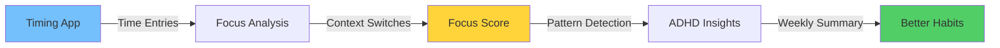
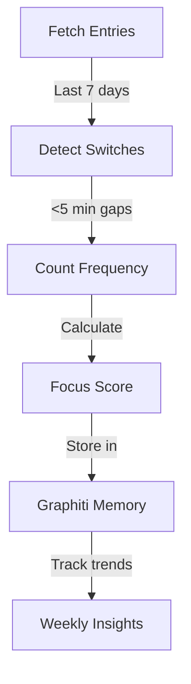

# ⏱️ Timing Integration Setup & Features

**Track your focus, spot context switches, and align priorities with reality**

> 🎯 **Quick Setup**: [Jump to 3-step setup](#-quick-setup-3-steps) | 📊 [See what you get](#-what-youll-get)

---

## 🌟 What's New (August 2025)



### New Metrics You'll Get:
- **📊 Focus Score (0-100)**: Based on context switch frequency
- **🔄 Switches/Hour**: How often you jump between projects
- **🎯 Alignment %**: Time on priorities vs time sinks
- **⚡ Hyperfocus Detection**: Find your flow states
- **🌊 Scatter Periods**: Identify rapid app-hopping

---

## 🚀 Quick Setup (3 Steps)

### Step 1: Get Your API Key
```bash
# Visit: https://web.timingapp.com
# Account → API & Integrations → Generate Key
```

### Step 2: Configure GTD Coach
```bash
# Copy example file
cp .env.example .env

# Edit .env and add:
TIMING_API_KEY=your-key-here
TIMING_MIN_MINUTES=30  # Only show 30+ min projects
```

### Step 3: Test It
```bash
# Test basic integration
./docker-run.sh timing

# Test full analysis
docker compose run gtd-coach python3 test_timing_graphiti_integration.py
```

✅ **Done!** Your next review will include focus tracking.

---

## 📊 What You'll Get

### During Reviews
```
📊 Your Focus Score: 73/100
   (Good focus - manageable switching patterns)

✅ Priority Alignment: 68%

Top time sinks not in priorities:
• Web Browsing: 11.8h
• Communication: 9.7h
```

### In Weekly Summaries
```markdown
## ⏱️ Timing App Analysis

### Focus Metrics
- Focus Score: 🟢 73/100
- Context Switches: 4.2/hour
- Alignment Score: ✅ 68%

### Major Time Sinks
- Web Browsing: 11.8h (browsing)
- Communication: 9.7h (communication)

### Time Management Recommendations
- Only 35% on A priorities - block time for important tasks
- 8.6h in communication - batch email/chat checking
```

---

## 🎯 Simple Project Setup (5 Minutes)

### Create 5 Projects in Timing

Keep it simple - just 5 projects covers everything:

| Project | Color | For |
|---------|-------|-----|
| **Deep Work** | 🔵 Blue | Focused coding, writing, strategy |
| **Communication** | 🟢 Green | Email, Slack, meetings |
| **Learning** | 🟡 Yellow | Courses, reading, research |
| **Admin** | 🟠 Orange | Planning, organizing, reviews |
| **Personal** | 🟣 Purple | Breaks, personal tasks |

### Quick Rules with ⌥-Drag

1. **Find an app** in your activity list
2. **Hold ⌥** (Option key)
3. **Drag** to the right project
4. ✅ Auto-categorizes forever!

**Examples:**
- ⌥-drag VS Code → Deep Work
- ⌥-drag Slack → Communication
- ⌥-drag Safari → Learning (or Admin)

---

## 📈 Understanding Your Metrics

### Focus Score Breakdown

| Score | What It Means | ADHD Action |
|-------|---------------|-------------|
| **80-100** | Excellent focus | You're in the zone! |
| **60-79** | Good focus | Minor tweaks needed |
| **40-59** | Moderate | Try time-blocking |
| **20-39** | Scattered | Need intervention |
| **0-19** | Crisis mode | Major changes needed |

### What Causes Low Scores?

- **Too many switches**: >10 per hour
- **Scatter periods**: 3+ switches in 15 min
- **No focus periods**: No 30+ min blocks
- **App hopping**: Browser → Email → Slack loops

### How to Improve

1. **Batch similar tasks**: Group all emails
2. **Time-block**: 25-min Pomodoros
3. **App blockers**: During focus time
4. **Physical movement**: Between switches

---

## 🔧 Advanced Features

### API Endpoints We Use

| Endpoint | Purpose | What We Get |
|----------|---------|-------------|
| `/time-entries` | Individual entries | Context switches |
| `/report` | Aggregated data | Project summaries |

### Data Analysis Pipeline



### What Gets Tracked

- **Every context switch** <5 minutes
- **Focus periods** >30 minutes
- **Scatter periods** (3+ switches/15min)
- **App transitions** (which apps you switch between)
- **Time of day patterns** (when you focus best)

---

## 🆘 Troubleshooting

### "No timing data showing"
```bash
# Check API key
cat .env | grep TIMING

# Test connection
./docker-run.sh timing

# Check logs
docker compose logs | grep timing
```

### "Focus score seems wrong"
- **Remember**: It's based on last 7 days
- **Check**: Are you categorizing projects?
- **Note**: Uncategorized = more switches

### "API timeout errors"
```bash
# Increase timeout (edit timing_integration.py)
timeout=5.0  # Instead of 3.0
```

### "Too many projects showing"
```bash
# Edit .env
TIMING_MIN_MINUTES=60  # Show only 1+ hour projects
```

---

## 📱 Daily Workflow

### The ADHD Way

1. **Morning**: Don't check Timing
2. **During work**: Let it track automatically
3. **Context switch**: Hit ⌃⌥⌘P if you remember
4. **End of day**: Don't check Timing
5. **Weekly review**: See your patterns!

### What NOT to Do

❌ Check Timing multiple times per day  
❌ Try to categorize everything perfectly  
❌ Create complex project hierarchies  
❌ Feel bad about low focus scores  
❌ Obsess over 100% accuracy  

---

## 📊 Sample Integration Output

### What You'll See in Reviews
```
============================================================
TIMING + GRAPHITI INTEGRATION TEST
============================================================

1. TESTING TIMING ANALYSIS
✓ Fetched 19 time entries

🔄 Analyzing context switches...
  • Total switches: 7
  • Switches per hour: 4.2
  • Focus periods: 3
  • Scatter periods: 1

🎯 Calculating focus metrics...
  • Focus score: 73/100
  • Interpretation: Good focus - manageable switching

2. TESTING PRIORITY COMPARISON

📊 TIME ALIGNMENT REPORT
⚠️ Alignment Score: 45%
   Time on priorities: 14.5h
   Total tracked: 32.3h

🕳️ Time Sinks (>2h, not in priorities):
   • Web Browsing (11.8h) - browsing
   • Random Apps (6.0h) - other

📋 Actions:
   → Only 45% on priorities - realign your time
   → 11.8h on browsing - use website blockers
```

---

## 🎯 Success Metrics

You're winning if:
- ✅ Focus score trending up (even slowly)
- ✅ Alignment % improving week-over-week
- ✅ Fewer scatter periods over time
- ✅ More hyperfocus periods detected

You're NOT failing if:
- ❌ Low initial scores (normal for ADHD!)
- ❌ Lots of context switches (awareness is step 1)
- ❌ Poor alignment (now you know!)
- ❌ Forget to categorize (automation handles most)

---

## 🚀 Next Steps

1. ✅ Set up API key (2 min)
2. ✅ Test integration (1 min)
3. ✅ Run a review (30 min)
4. ✅ Check weekly summary (5 min)
5. 🎉 Celebrate the insights!

---

**Remember**: Focus scores are just data, not judgment. Every insight helps you work WITH your ADHD brain! 🧠

*Questions? Check the [main guide](README.md) or [troubleshooting](KNOWN_ISSUES.md)*