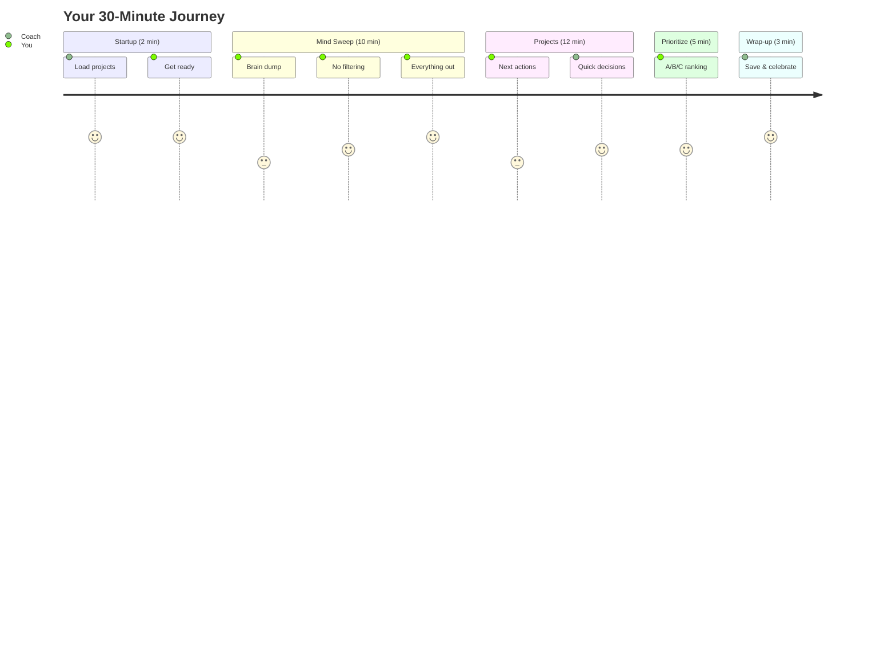

# 📖 GTD Coach Usage Guide

**Your ADHD-friendly guide to weekly reviews that actually work**

> 🎯 **TL;DR**: Run `./start-coach.sh` and follow the prompts for 30 minutes.

---

## 🏁 Before You Start

### ✅ Quick Checklist
- [ ] **LM Studio** running? (`lms ps`)
- [ ] **30 minutes** blocked?
- [ ] **Phone** in another room?
- [ ] **Coffee/water** ready?
- [ ] **Standing** or able to move?

### 🚀 Start Command
```bash
./start-coach.sh
```

---

## 📍 What Happens (Visual Guide)



---

## 🎭 Phase-by-Phase Guide

### Phase 1: STARTUP (2 minutes)
**What happens:**
- Coach welcomes you
- Timing app loads your projects (if configured)
- Sets the mood for success

**Your job:**
- Just show up
- Take a breath
- Say "yes" when ready

**Coach says:**
```
Welcome! I'm your ADHD coach for the next 30 minutes.
📊 Fetching your project data from Timing...
✓ Loaded 6 projects from last week
Are you ready to start? (yes/no)
```

---

### Phase 2: MIND SWEEP (10 minutes)

#### Part A: Capture (5 min)
**What happens:**
- Timer starts automatically
- Audio alerts at 4 min, 1 min remaining

**Your job:**
- Type EVERYTHING on your mind
- One thought per line
- Press Enter after each
- Empty line + 'y' to finish early

**Tips:**
- 🧠 Don't filter
- 📝 Incomplete is fine
- 🎯 Quantity > Quality

**Example input:**
```
Fix that bug in login
Call mom
Dentist appointment
That email from Sarah
Website redesign ideas
[empty line]
Finish capture early? (y/n): n
```

#### Part B: Processing (5 min)
**What happens:**
- Coach shows your list
- Asks about patterns
- No decisions yet!

**Your job:**
- Review what you captured
- Notice themes
- Still no filtering!

---

### Phase 3: PROJECT REVIEW (12 minutes)

**What happens:**
- Shows projects from Timing (real data!)
- 45 seconds per project
- Quick next-action focus

**Your job:**
- Fast decisions only
- "What's the NEXT step?"
- Skip if stuck

**With Timing data:**
```
[1/6] Project: Web Browsing
Last week: 10.9 hours
Next action (45 sec): organize bookmarks
```

**Decision speed:**
- ⚡ 10 sec: Perfect
- ✅ 30 sec: Good
- ⚠️ 45 sec: Move on!

---

### Phase 4: PRIORITIZATION (5 minutes)

**What happens:**
- Shows all your actions
- Asks for A/B/C ranking
- Compares with Timing data

**Priority guide:**
| Level | Meaning | Example |
|-------|---------|---------|
| **A** | Must do this week | Client deadline |
| **B** | Should do if possible | Team meeting prep |
| **C** | Nice to have | Organize desktop |

**Coach shows:**
```
1. Email designer for quote
2. Fix login bug
3. Call mom

Enter priorities (e.g., A,B,C):
> B,A,A
```

---

### Phase 5: WRAP-UP (3 minutes)

**What happens:**
- Shows your focus score (NEW!)
- Displays alignment percentage
- Saves everything
- Celebrates!

**You see:**
```
📊 Your Focus Score: 73/100
   (Good focus - manageable switching patterns)

✅ Priority Alignment: 68%

Review completed in 29.5 minutes.
Projects reviewed: 8
Decisions made: 12
Items captured: 23

🎉 REVIEW COMPLETE! Great job showing up!
```

---

## 📊 After Your Review

### Check Your Insights
```bash
# Generate weekly summary
./docker-run.sh summary

# View in terminal
cat ~/gtd-coach/summaries/weekly_summary_*.md | less
```

### What You'll See:
```markdown
# GTD Weekly Review Summary

## 📊 Productivity Metrics
- Completion Rate: 100%
- Average Duration: 28.5 minutes

## ⏱️ Timing App Analysis (NEW!)
- Focus Score: 🟢 73/100
- Context Switches: 4.2/hour
- Alignment Score: ✅ 68%

### Major Time Sinks
- Web Browsing: 10.9h (browsing)
- Communication: 8.6h (communication)

### Time Management Recommendations
- Only 35% on A priorities - block time for important tasks
- 8.6h in communication - batch email/chat checking

## 🎯 ADHD Pattern Analysis
- Task Switching: 3 patterns detected
- Coherence Score: 0.72/1.0

## 💡 Insights & Recommendations
✅ What's Working Well
- Strong focus score of 73
- Good priority alignment

⚠️ Areas for Improvement
- 4 scatter periods detected
- Consider time-blocking for deep work
```

---

## 🎮 Pro Tips

### For Better Focus Scores
1. **Batch similar tasks** - Group emails, calls, etc.
2. **Use app blockers** - During focus time
3. **Time-box everything** - Even small tasks

### For Smoother Reviews
1. **Same time weekly** - Build the habit
2. **Stand up** - Movement helps ADHD focus
3. **Talk out loud** - Verbalize while typing

### For Timing Integration
1. **Organize projects** - In Timing app first
2. **Name consistently** - Match GTD categories
3. **Review weekly** - Check alignment score

---

## 🔧 Customization

### Adjust Phase Times
Edit `gtd-review.py`:
```python
# Line ~420
phase_start = self.phase_timer("Mind Sweep", 10)  # Change 10 to desired minutes
```

### Change Coach Personality
Edit `prompts/system-prompt.txt`:
```
You are an ADHD coach...  # Modify coaching style here
```

### Filter Timing Projects
Edit `.env`:
```
TIMING_MIN_MINUTES=60  # Only show 1+ hour projects
```

---

## ⌨️ Keyboard Shortcuts

| During... | Press | To... |
|-----------|-------|-------|
| Mind Sweep | `Enter` (empty) | Offer early exit |
| Mind Sweep | `Ctrl+C` | Force end phase |
| Projects | Type `skip` | Skip project |
| Any phase | `Ctrl+C` twice | Emergency exit |

---

## 📈 Understanding Your Metrics

### Focus Score (0-100)
| Score | Meaning | Action |
|-------|---------|--------|
| 80-100 | Excellent | Keep it up! |
| 60-79 | Good | Minor tweaks |
| 40-59 | Moderate | Need strategies |
| 0-39 | Scattered | Major changes needed |

### Alignment Score (%)
| Score | Meaning | Action |
|-------|---------|--------|
| 70%+ | Great match | Priorities = Reality |
| 40-69% | Some drift | Adjust priorities |
| <40% | Misaligned | Reality check needed |

### Context Switches/Hour
| Rate | Meaning | ADHD Impact |
|------|---------|-------------|
| <3 | Low switching | Excellent focus |
| 3-6 | Normal | Manageable |
| 6-10 | High | May feel scattered |
| >10 | Very high | Intervention needed |

---

## 🆘 Common Issues

### "I'm overwhelmed during mind sweep"
- **Solution**: Just write single words
- **Example**: "dentist" instead of "Schedule dentist appointment for cleaning"

### "Projects phase too fast"
- **Solution**: Type "tbd" (to be determined)
- **Coach accepts**: Any text as valid input

### "Can't decide priorities"
- **Solution**: Use this rule:
  - A = Will cause problems if not done
  - B = Would be nice to finish
  - C = Everything else

### "Focus score is low"
- **Solution**: Normal for ADHD!
- **Goal**: Improvement over time, not perfection
- **Track**: Weekly trends matter more than single scores

### "No Timing data showing"
- **Check**: `.env` file has `TIMING_API_KEY`
- **Test**: `./docker-run.sh timing`
- **Fallback**: Works fine with mock data

---

## 🎯 Success Metrics

You're succeeding if:
- ✅ You complete reviews (even messy ones)
- ✅ Your focus score trends upward
- ✅ You feel clearer after reviews
- ✅ You show up consistently

You're NOT failing if:
- ❌ Focus score is low (it's just data)
- ❌ You skip some projects (that's fine)
- ❌ Mind sweep is chaotic (that's the point)
- ❌ Priorities change weekly (life happens)

---

## 📱 Quick Reference Card

**Print this section and keep it handy:**

```
┌─────────────────────────────────┐
│        GTD COACH CHEAT SHEET    │
├─────────────────────────────────┤
│ START: ./start-coach.sh         │
│                                 │
│ PHASES:                         │
│ 1. Startup     (2 min)  Ready?  │
│ 2. Mind Sweep  (10 min) Dump!   │
│ 3. Projects    (12 min) Next?   │
│ 4. Prioritize  (5 min)  ABC?    │
│ 5. Wrap-up     (3 min)  Done!   │
│                                 │
│ FOCUS SCORE: Higher = Better    │
│ ALIGNMENT: Time vs Priorities   │
│                                 │
│ SUMMARY: ./docker-run.sh summary│
└─────────────────────────────────┘
```

---

## 🔗 Advanced Features

### Timing App Integration
**Setup once:**
```bash
cp .env.example .env
# Add: TIMING_API_KEY=your-key-here
```

**What you get:**
- 📊 Real project data in reviews
- 🎯 Focus scores (0-100)
- 🔄 Context switch tracking
- ⚡ Priority alignment analysis
- 🕳️ Time sink identification

### Graphiti Memory
**Automatic tracking of:**
- Task switching patterns
- Coherence scores
- Focus quality metrics
- Behavioral trends

**View insights:**
```bash
./docker-run.sh summary
```

### Langfuse Monitoring
**Track AI performance:**
```bash
docker run -p 3000:3000 langfuse/langfuse
cp langfuse_tracker.py.example langfuse_tracker.py
# Add your keys
```

---

**Remember**: The best review is the one you complete! 🎉

*Questions? Check [Troubleshooting](KNOWN_ISSUES.md) or [file an issue](https://github.com/devops-adeel/gtd-coach/issues)*