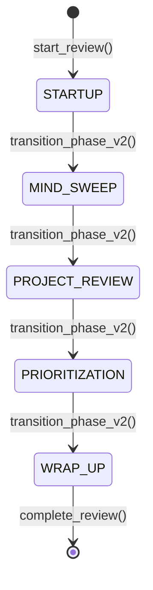

# API & Implementation Reference

## Tool Interfaces

### Conversation Tools (v3)

| Tool | Purpose | Returns | Key Pattern | Source |
|------|---------|---------|-------------|--------|
| `ask_question_v3` | Open-ended questions | `str` | Single interrupt | [conversation_v3.py:31](../../gtd_coach/agent/tools/conversation_v3.py#L31) |
| `ask_yes_no_v3` | Boolean questions | `bool` | Type conversion | [conversation_v3.py:74](../../gtd_coach/agent/tools/conversation_v3.py#L74) |

### Capture Tools (v2)

| Tool | Purpose | Side Effect | Source |
|------|---------|-------------|--------|
| `save_user_response_v2` | Store generic response | JSON file write | [capture_v2.py](../../gtd_coach/agent/tools/capture_v2.py) |
| `save_mind_sweep_item_v2` | Store mind sweep entry | Append to list | [capture_v2.py](../../gtd_coach/agent/tools/capture_v2.py) |
| `save_weekly_priority_v2` | Store priority with rank | Sorted by rank | [capture_v2.py](../../gtd_coach/agent/tools/capture_v2.py) |
| `save_project_update_v2` | Store project status | Update dict | [capture_v2.py](../../gtd_coach/agent/tools/capture_v2.py) |

### Time Management Tools

| Tool | Purpose | Returns | Source |
|------|---------|---------|--------|
| `transition_phase_v2` | Change review phase | `Dict` with status | [time_manager_v2.py:107](../../gtd_coach/agent/tools/time_manager_v2.py#L107) |
| `check_time_v2` | Check remaining time | `str` with urgency | [time_manager_v2.py:49](../../gtd_coach/agent/tools/time_manager_v2.py#L49) |
| `send_alert_v2` | Play audio alert | `str` confirmation | [time_manager_v2.py:219](../../gtd_coach/agent/tools/time_manager_v2.py#L219) |

## State Management

### Phase State Machine



### State Shape

```python
class AgentState(TypedDict):
    """Core state structure for GTD Agent"""
    messages: List[BaseMessage]
    current_phase: str
    phase_start_time: datetime
    awaiting_input: bool
    time_pressure_mode: bool
    context_metrics: Dict[str, Any]
```

## Recent Fixes (v3)

### Interrupt Warning Fix
**Problem**: Misleading "completed despite interrupt" warnings  
**Solution**: Changed to debug level - this is normal LangGraph behavior  
**Commit**: [63559e1](../../gtd_coach/observability/interrupt_monitor.py#L99)

### Token Tracking Fix
**Problem**: LM Studio uses different response format than OpenAI  
**Solution**: Added multiple extraction paths  
**Code**: [core_metrics_fix.py:50-63](../../gtd_coach/agent/core_metrics_fix.py#L50)

### EntityEdge Error Fix
**Problem**: Graphiti EntityEdge objects are immutable  
**Solution**: Try-except for attribute setting  
**Code**: [graphiti.py:754-759](../../gtd_coach/integrations/graphiti.py#L754)

## Message Formats

### User Input Processing
```python
# Input from interrupt
response = interrupt("Your question?")
# Returns: str (raw user input)

# Processed for agent
message = HumanMessage(content=response)
state["messages"].append(message)
```

### Token Usage Format
```python
# OpenAI format
{
    "response_metadata": {
        "token_usage": {
            "prompt_tokens": 100,
            "completion_tokens": 50,
            "total_tokens": 150
        }
    }
}

# LM Studio format  
{
    "usage": {
        "prompt_tokens": 100,
        "completion_tokens": 50,
        "total_tokens": 150
    }
}
```

## Integration Points

### Langfuse Tracing
```python
# Enable tracing
tracer = LangfuseTracer(
    public_key=os.getenv("LANGFUSE_PUBLIC_KEY"),
    secret_key=os.getenv("LANGFUSE_SECRET_KEY")
)

# Wrap agent
traced_agent = inject_token_tracking(agent, tracer)
```

### Graphiti Memory
```python
# Initialize
memory = GraphitiMemory(
    uri=os.getenv("NEO4J_URI"),
    user=os.getenv("NEO4J_USERNAME"),
    password=os.getenv("NEO4J_PASSWORD")
)

# Search with temporal decay
results = memory.search(
    query="weekly review patterns",
    num_results=5,
    apply_temporal_decay=True
)
```

## Environment Variables

| Variable | Purpose | Default | Required |
|----------|---------|---------|----------|
| `OPENAI_API_BASE` | LLM endpoint | `http://localhost:1234/v1` | Yes |
| `OPENAI_API_KEY` | API key | `lm-studio` | Yes |
| `LANGFUSE_PUBLIC_KEY` | Tracing | None | No |
| `LANGFUSE_SECRET_KEY` | Tracing | None | No |
| `NEO4J_URI` | Graphiti | None | No |
| `TIMING_API_KEY` | Time tracking | None | No |

## Docker Configuration

### Volume Mounts
```yaml
volumes:
  - ./data:/app/data           # Review data persistence
  - ./config:/app/config        # Prompts and settings
  - ./scripts:/app/scripts      # Utility scripts
```

### Network Requirements
```yaml
networks:
  gtd-network:
    driver: bridge
    ipam:
      config:
        - subnet: 172.20.0.0/16
```

## Testing Patterns

### Unit Test Pattern
```python
@pytest.mark.asyncio
async def test_single_interrupt_tool():
    """Test v3 tool with single interrupt"""
    with patch('langgraph.types.interrupt') as mock_interrupt:
        mock_interrupt.return_value = "user response"
        
        result = ask_question_v3("Test question?")
        
        assert result == "user response"
        assert mock_interrupt.call_count == 1  # Single interrupt
```

### Integration Test Pattern
```python
def test_agent_interrupt_resume():
    """Test full interrupt/resume cycle"""
    # Start conversation
    result = agent.invoke({"messages": [HumanMessage("start")]})
    assert "__interrupt__" in result
    
    # Resume with response
    result = agent.invoke(Command(resume="my answer"))
    assert "my answer" in result["messages"][-1].content
```

## Performance Considerations

### Token Limits
- **Context window**: 32K tokens (Llama 3.1 8B)
- **Aggressive trimming**: Keep last 20K tokens
- **System prompt**: ~2K tokens
- **Phase history**: ~5K tokens per phase

### Checkpointing
- **In-memory**: Development (MemorySaver)
- **SQLite**: Production (SqliteSaver)
- **Checkpoint frequency**: After each tool call

## Common Issues

### Issue: Zero token count
**Check**: LM Studio response format  
**Fix**: [core_metrics_fix.py](../../gtd_coach/agent/core_metrics_fix.py)

### Issue: Phase transition fails
**Check**: Valid phase name (not "WEEKLY_REVIEW")  
**Fix**: Use correct phase names: STARTUP, MIND_SWEEP, etc.

### Issue: Interrupt state pollution
**Check**: Multiple interrupts in one tool  
**Fix**: Use v3 single-interrupt pattern

## Quick Links

- [Agent Core](../../gtd_coach/agent/core.py)
- [v3 Tools](../../gtd_coach/agent/tools/conversation_v3.py)
- [Runner](../../gtd_coach/agent/runner.py)
- [Prompts](../../scripts/langfuse/upload_prompts_v3.py)
- [Docker Config](../../docker-compose.yml)