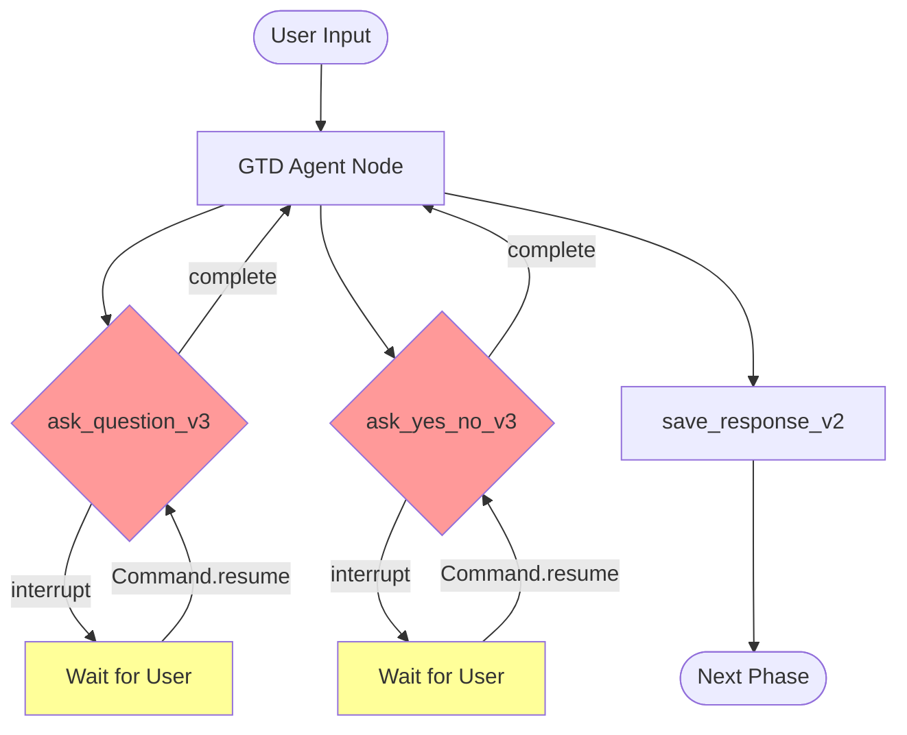
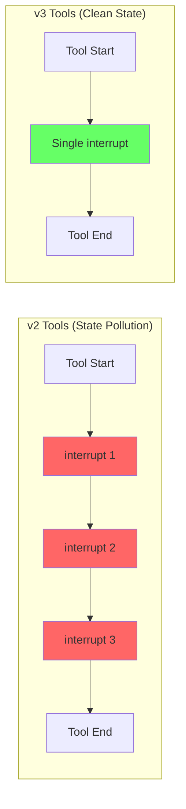
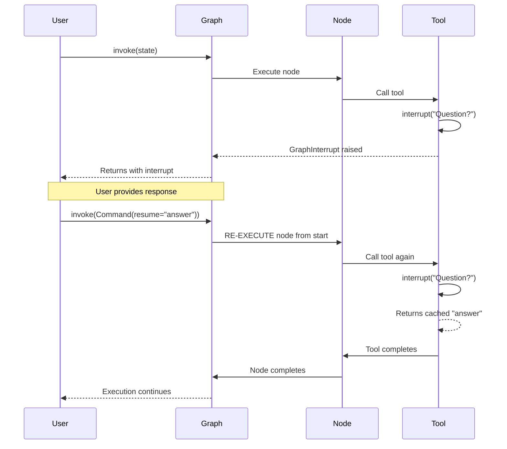

# LangGraph Agent Development Guide

## Quick Visual Overview



## The Single-Interrupt Pattern Discovery

### Visual: v2 Problem vs v3 Solution



### What Changed and Why

**v2 Problem**: Multiple interrupts in one tool caused state pollution
```python
# v2 conversation tool (problematic)
@tool
def check_in_with_user_v2(question: str, follow_up: str = None):
    response = interrupt(question)        # First interrupt
    
    if follow_up:
        confirm = interrupt(follow_up)    # Second interrupt - STATE POLLUTION!
        # On resume, both interrupts re-execute with mismatched values
    
    return {"response": response, "confirm": confirm}
```

**v3 Solution**: One interrupt per tool ensures clean state
```python
# v3 conversation tools (fixed)
@tool
def ask_question_v3(question: str, context: str = None) -> str:
    # Single interrupt - no state pollution possible
    response = interrupt(question)
    return response

@tool  
def ask_yes_no_v3(question: str, default: bool = True) -> bool:
    # Separate tool, separate interrupt - clean isolation
    response = interrupt(question)
    return parse_bool(response, default)
```

## Understanding Node Re-execution

### The Command(resume) Flow



### Key Insight

When resuming with `Command(resume=value)`:
1. **Node re-executes from beginning** (not just from interrupt point)
2. **Interrupt returns cached value** immediately
3. **Tool completes normally** with the cached response

This is why you see "Tool completed despite interrupt" in logs - it's normal behavior!

## Token Tracking Architecture

### LM Studio vs OpenAI Format

```python
# Token extraction logic (core_metrics_fix.py)
def extract_token_usage(message):
    # OpenAI format
    if hasattr(message, 'response_metadata'):
        usage = message.response_metadata.get('token_usage')
    
    # LM Studio format (different structure)
    if not usage and hasattr(message, 'usage_metadata'):
        usage = message.usage_metadata
    
    # Additional LM Studio check
    if not usage and hasattr(message, 'usage'):
        usage = message.usage
```

## Debugging with Langfuse

### Reading Traces for Interrupt Patterns

```
[TRACE VIEW]
├── Session: weekly-review-2025-01-22
├── Generation: ask_question_v3
│   ├── Event: tool.start
│   ├── Event: interrupt.called
│   └── Event: tool.complete (with cached value)
├── Generation: ask_question_v3 (re-execution)
│   ├── Event: tool.start  
│   ├── Event: interrupt.resumed
│   └── Event: tool.complete
```

### Quick Debug Checklist

- [ ] Check trace for re-execution pattern (two tool.start events = normal)
- [ ] Verify single interrupt per tool (multiple = state pollution risk)
- [ ] Monitor token tracking (0 tokens = check LM Studio format)
- [ ] Look for "interrupt.resumed" events (confirms proper resume)

## Building New Tools

### Template for v3 Conversation Tools

```python
#!/usr/bin/env python3
"""
New conversation tool following v3 single-interrupt pattern
"""

from langchain_core.tools import tool
from langgraph.types import interrupt
from gtd_coach.observability import monitor_interrupt

@tool
@monitor_interrupt("my_new_tool")  # Add observability
def my_new_tool(prompt: str, context: str = None) -> str:
    """
    Tool with single interrupt for clean state management.
    
    Args:
        prompt: What to ask the user
        context: Optional context for logging
    
    Returns:
        User's response as string
    """
    # Log for debugging
    logger.info(f"Asking: {prompt} (context: {context})")
    
    # SINGLE interrupt - the key pattern
    response = interrupt(prompt)
    
    # Process response if needed
    processed = response.strip()
    
    # Log completion
    logger.info(f"User responded: {processed}")
    
    return processed
```

### Integration Checklist

- [ ] One interrupt per tool maximum
- [ ] Add @monitor_interrupt decorator for observability
- [ ] Export in `__init__.py`
- [ ] Add to prompt instructions (upload_prompts_v3.py)
- [ ] Test with Command(resume) pattern

## Common Pitfalls to Avoid

### ❌ Don't: Multiple Interrupts
```python
# This will cause state pollution on resume
response1 = interrupt("First question")
response2 = interrupt("Second question")  # BAD!
```

### ✅ Do: Separate Tools
```python
# Each tool handles one interrupt
response1 = ask_question_v3("First question")
response2 = ask_question_v3("Second question")  # Good!
```

### ❌ Don't: Dynamic Node Structure
```python
# Changing interrupt count based on conditions
if condition:
    interrupt("Extra question")  # Breaks resume index matching!
```

### ✅ Do: Consistent Structure
```python
# Always same number of interrupts
response = interrupt("Standard question")
if condition:
    # Handle logic after interrupt, not with more interrupts
    process_special_case(response)
```

## Testing Your Tools

### Basic Test Pattern
```python
# Test normal flow
result = agent.invoke({"messages": [HumanMessage("Start review")]})
assert "__interrupt__" in result

# Test resume flow  
result = agent.invoke(Command(resume="User response"))
assert "Tool completed" in logs  # Expected due to re-execution
```

### Langfuse Integration Test
```python
# Enable trace analysis
export ANALYZE_AGENT_BEHAVIOR=true

# Run test
pytest tests/test_agent_tools.py -v

# Check for:
# - Double tool invocation (normal)
# - Single interrupt per tool
# - Proper state persistence
```

## Links to Key Files

| Component | File | Key Lines |
|-----------|------|-----------|
| v3 Tools | [conversation_v3.py](../../gtd_coach/agent/tools/conversation_v3.py) | L31-71 |
| Token Fix | [core_metrics_fix.py](../../gtd_coach/agent/core_metrics_fix.py) | L50-63 |
| Interrupt Monitor | [interrupt_monitor.py](../../gtd_coach/observability/interrupt_monitor.py) | L93-106 |
| v3 Prompts | [upload_prompts_v3.py](../../scripts/langfuse/upload_prompts_v3.py) | L86-99 |

## Next Steps

1. Review [API Reference](./api-reference.md) for tool signatures
2. Check recent [commits](https://github.com/yourusername/gtd-coach/commits/main) for examples
3. Test with `scripts/langfuse/upload_prompts_v3.py` for prompt updates